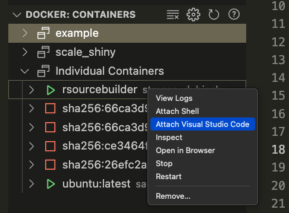
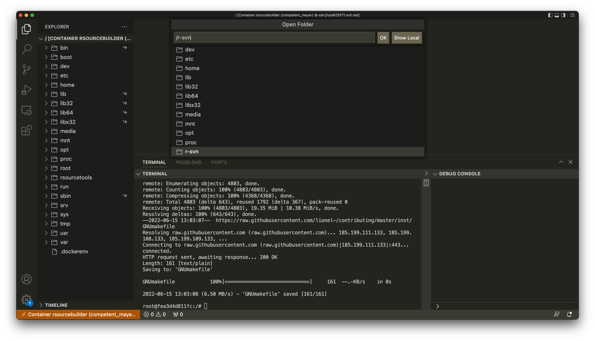

# r-devel-doc

[WORK IN PROGRESS]

> Note: this process is built on top of personal knowledge and scripts gathered from :
>
> - https://bookdown.org/lionel/contributing/
> - https://github.com/r-devel/r-svn/blob/master/.github/workflows/build-svn.yaml

Documenting the process of submitting a bug fix to R

1. Fork https://github.com/r-devel/r-svn to your GitHub Account

2. Clone the current repo

I suggest you rebuild the container every time so you have a latest version of system requirements

```
# Build the docker image
docker build -t rsourcebuilder --no-cache .
# Launch the image and let it hang, so that we can enter it via VSCode
docker run -d rsourcebuilder tail -f &> /dev/null
# Wait some time for the container to launch
sleep 30
```

3. Go in the container using VSCode docker feature



4. Once inside the container, run the following command, replacing the github url with yours

```
bash /rsourcetools/tools.sh https://github.com/ColinFay/r-svn
```

This will clone the repo & add some tools to the build folder

5. Open folder : /r-svn



6. Do your changes

7. Run the build

```
cd build
bash ./build.sh # (Note that the build can take some time)
```

The script will also run the tests.
